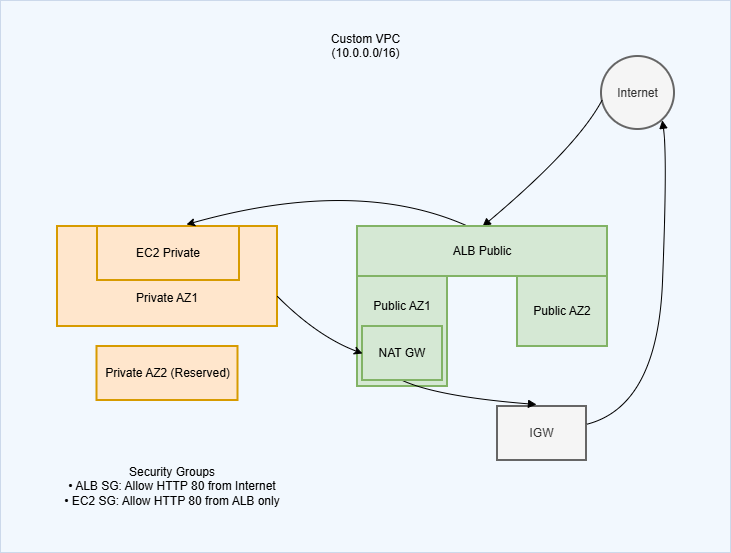

# CloudShield Lab — Secure Multi-AZ AWS Infrastructure with Terraform

## Overview

CloudShield Lab is a hands-on cloud engineering project designed to demonstrate real-world AWS networking, security, and Infrastructure as Code (IaC) practices.

The project deploys a private EC2 web application inside isolated private subnets while exposing the application securely through an internet-facing Application Load Balancer (ALB). Outbound internet access for private resources is handled via a NAT Gateway. The entire infrastructure is provisioned and managed using Terraform.

CloudShield Lab focuses on production-style cloud architecture patterns including VPC design, subnet segmentation, routing, security boundaries, load balancing, and infrastructure automation.

---

## Architecture



### High-Level Design

- Custom VPC (10.0.0.0/16)
- Two public subnets across separate Availability Zones
- Two private subnets across separate Availability Zones
- Internet Gateway for inbound traffic
- NAT Gateway for outbound access from private resources
- Application Load Balancer in public subnets
- EC2 web server deployed in a private subnet
- Least-privilege security group configuration
- Terraform-managed infrastructure

The EC2 instance has **no public IP address** and is reachable only through the Application Load Balancer.

---

## Objectives

- Design and deploy a secure, multi-AZ AWS VPC
- Separate infrastructure into public and private network tiers
- Deploy compute resources in private subnets
- Secure inbound access through an Application Load Balancer
- Enable outbound internet access via NAT Gateway
- Apply least-privilege security group rules
- Automate infrastructure using Terraform
- Produce professional documentation suitable for portfolio review

---

## Technology Stack

- AWS VPC
- EC2
- Application Load Balancer
- NAT Gateway
- Terraform
- Amazon Linux
- Apache HTTP Server

---

## Key Features

### Networking

- CIDR-based subnet design
- Public and private subnet segmentation
- Internet Gateway routing for inbound traffic
- NAT Gateway for outbound internet access
- Route tables and subnet associations
- Multi-AZ availability and fault tolerance

### Security

- ALB security group allowing HTTP access from the internet
- EC2 security group allowing HTTP access **only from the ALB**
- No direct public access to compute resources
- Clear separation of network tiers

### Compute & Load Balancing

- EC2 web server hosted in a private subnet
- Application Load Balancer distributing inbound traffic
- Target group health checks to ensure application availability

### Infrastructure as Code

- Entire environment provisioned using Terraform
- Repeatable, version-controlled deployments
- Clean teardown and recreation of resources
- Clear dependency management between components

---

## Terraform Structure

terraform/
main.tf
variables.tf
outputs.tf
versions.tf
userdata.sh

---

## Deployment Instructions

From the `terraform` directory:

```bash
terraform init
terraform fmt
terraform validate
terraform plan
terraform apply
